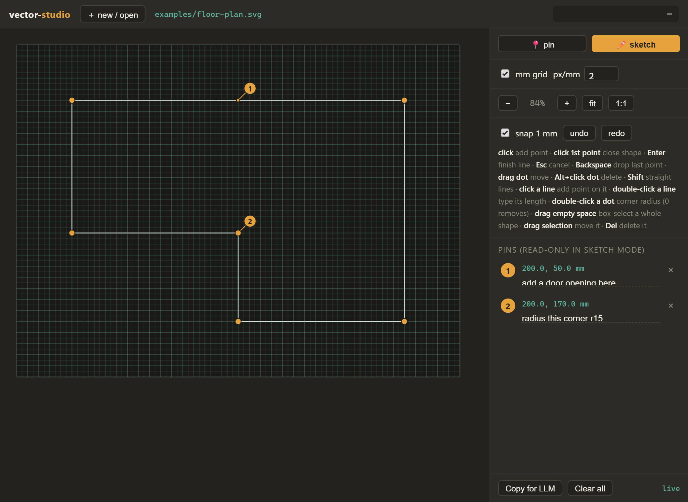
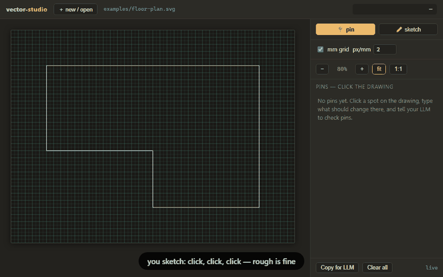
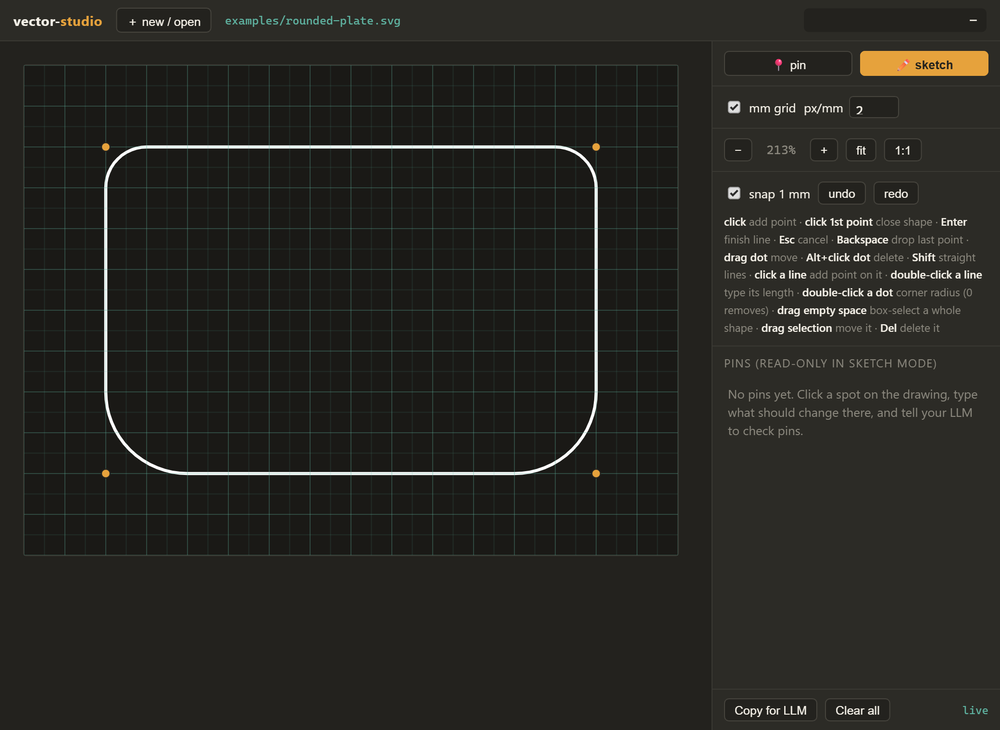

# Vector Studio LLM

> Sketch it rough, pin what's wrong, let the LLM do the geometry — no pixels, no wasted tokens.





A two-file, no-build, local sketching loop for making vector drawings **with**
a coding agent (Claude Code, Cursor, aider, a local model — anything that can
edit files). You draw rough shapes and point at things; the LLM does the math.

It is deliberately weak as a vector app. That's the point:

1. **Draw, don't describe.** Rough geometry is faster to sketch than to put
   into words — click out a floor plan in seconds instead of writing "a room
   about 3 by 2 meters with a notch in the corner…".
2. **Pins instead of 50 tools.** Click a spot, type what should change there
   ("bin wall here", "arch this edge, centered on the origin pin"). The pin
   replaces the tool palette; the LLM is the tools.
3. **The loop is text all the way down.** The drawing is an SVG file; pins are
   a small JSON sidecar with exact mm coordinates. Your agent reads and edits
   a few KB of text — no screenshot round-trips burning image tokens while the
   model guesses geometry from pixels. Cheaper, faster, and precise.

No API key, no cloud, no dependencies beyond Python's standard library. The
tool never talks to an LLM itself — **the filesystem is the interface**, so
any file-editing agent already works with it.

## Quickstart

Get the code — either way works:

```bash
git clone https://github.com/ryangadz/vector-studio-llm && cd vector-studio-llm
```

or **Code ▸ Download ZIP** on this page, unzip, and open the folder.

Check your Python is 3.10+ (that's the only requirement):

```bash
python --version
```

Then start the viewer:

```bash
python serve.py
```

Open http://127.0.0.1:8103/ — pick an example (or create a new sketch, it just
takes a name; the canvas grows as you draw). On Windows, `vector-studio.bat`
starts the server and opens the browser in one double-click.

The viewer is a single `viewer.html`; no build step.

## Your first loop

1. Open `examples/floor-plan.svg` from the file list.
2. Drop two 📍 pins: click a wall, type what should change there ("make this
   wall 2400 mm"), click a corner ("round this corner, r 100"). Pins autosave
   to `examples/floor-plan.svg.pins.json`.
3. In a coding agent running in this folder (Claude Code, Cursor, aider —
   anything that edits files), type this sentence, literally:

   > Check the pins in examples/floor-plan.svg.pins.json and make the edits.

4. The viewer reloads with the edits. Drag a dot, drop more pins, go again.

## The loop

1. **You** sketch rough outlines in ✏️ sketch mode and/or drop 📍 pins with
   notes on things that should change.
2. Geometry autosaves into the SVG itself; pins autosave to
   `<drawing>.svg.pins.json` next to it — both with exact coordinates
   (2 SVG units = 1 mm by default, adjustable).
3. **Your agent** reads the sketch + sidecar, edits the SVG in place, and
   clears the pins it addressed.
4. The viewer notices the file changed and reloads itself. You drag dots,
   drop more pins, and go again.

Iteration is where it pays off: a change that would cost another CAD
round-trip is one sentence, and the agent regenerates from your model.

## You always know the mode

Pin mode and sketch mode each paint the canvas with their own color — amber
for 📍 pin, teal for ✏️ sketch: a tinted frame around the drawing area, a
mode-shaped cursor (a pin with its tip at the point; a crosshair for
sketching), and a **ghost preview** at the cursor showing exactly what a
click will do — the next pin number, or a vertex dot sitting at its snapped
position. The big mode buttons match the tint, and **P** / **S** switch
modes from the keyboard.

Controls live in a right rail on wide windows and move to a top bar when
the window is tall and narrow (say, half-snapped beside a chat window) —
automatically, by window shape.

Pins live on the canvas itself: hover one to read its note, click it in pin
mode to edit or delete it right where it is.

## Sketching

- **Click** places points; click the first point to close a shape, click
  the **last placed point** (or press **Enter**) to finish an open line —
  both points grow hover rings while you draw, and a hint chip by the
  canvas edge spells it out. **Esc** cancels, **Backspace** drops the last
  point. **Shift** locks segments to 0/45/90°. The cursor auto-aligns with
  earlier points (dashed guides), so rectangles close square.
- **Drag a dot** to move it (snaps to whole mm; toggleable). **Alt+click a
  dot** deletes it. **Click a line** to add a point on it. Double-clicks
  are detected by the viewer itself (two taps within ~400 ms), so they work
  the same on touchpads and touchscreens.
- **Double-click a line** → type its exact length in mm. Parametric-style
  resize: the edited side keeps its direction and downstream geometry slides
  rigidly; on closed shapes the first parallel side absorbs the change, so
  nothing rotates.
- **Double-click a dot** → type a corner radius in mm (0 removes it).
  Fillets are parameters on the shape — arcs re-derive after every drag, and
  the dots never go away:

  
- **Drag empty space** → box-select. Only shapes *fully* inside the box
  select; drag the selection to move it, **Del** deletes, **Esc** deselects.
- **Ctrl+C / Ctrl+V** — a selection copies to the **system clipboard** as a
  standalone SVG fragment: the `data-vs` model attributes, canonical
  user-unit coordinates, and the drawing's unit/scale context on the root.
  It pastes into another studio file (converted through that context, so
  100 mm stays 100 mm across different px/mm), into Inkscape, a text
  editor, or an LLM chat. On paste the shapes ride the cursor as a ghost —
  snap and Shift apply — click drops them (one undo step, and they land
  selected), **Esc** cancels. Pasting while in pin mode switches to sketch
  mode. Clipboard content without `data-vs` shapes is ignored.
- **Ctrl+Z / Ctrl+Shift+Z** undo/redo. Live mm lengths appear only where
  they're changing (on the rubber line, and beside a dragged dot).
- Grid overlay, cursor readout, zoom with fit/1:1/Ctrl+scroll.
- **Units** — a selector switches display and input between **mm, cm, m, in,
  and ft-in**; readouts, typed lengths, snap, and grid all follow (snap
  becomes 1 cm / ¼″ / 1″ as fits the unit). Typed lengths take suffixes
  (`350mm`, `3.5m`, `12'6"`; in ft-in a bare number is inches). The choice
  saves into the drawing itself (`data-vs-unit`, plus `data-vs-scale` for
  px/mm), so a floor plan opens in feet while a part opens in mm —
  `examples/studio-apartment.svg` is a 20'×14' studio to try it on. Under
  the hood nothing changes: files stay SVG user units at px/mm.

## Multiple projects

A "project" is nothing more than a folder with SVGs in it (plus their
`.pins.json` sidecars once you drop pins). One install serves any of them —
point the server at the folder:

```bash
python serve.py --root path/to/project
```

Run several projects at once by giving each its own port:

```bash
python serve.py --root ~/sketches/kitchen --port 8103
python serve.py --root ~/drawings/logo --port 8104
```

The viewer always loads from the install folder, so project folders stay
clean — nothing in them but your drawings and their sidecars.

## The agent contract

What your LLM needs to know (also summarized by the **Copy for LLM** button):

- Sketch shapes are elements marked `data-vs="1"` — `<polygon>`/`<polyline>`
  with clean coordinates in **user units, 2 units = 1 mm**, origin at the
  viewBox top-left, y down.
- Pins live in `<drawing>.svg.pins.json`: each has `user` (SVG units), `mm`,
  and a free-text `note`. Address every pin, then write the sidecar back with
  `"pins": []`. The viewer picks up both files' changes automatically.
- A shape with corner radii is a `<path data-vs>` whose **model** rides in
  `data-vs-pts` (vertex list) + `data-vs-fillets` (`index:radius`, user
  units) + `data-vs-closed`; its `d` is derived. Edit the model, not `d` —
  the viewer re-derives `d` on load, so a stale `d` after your edit is fine.
- Mark any outline the human should keep point-editing with `data-vs="1"`.
  Freeform curves you author (tangent arcs, beziers) can be plain `<path>`s —
  they render fine but won't get drag dots.
- A drawing may carry `data-vs-unit` (the human's display unit: mm, cm, m,
  in, ftin) and `data-vs-scale` (px per mm) on the svg root; the sidecar
  mirrors them as `unit`/`pxPerMm`. Pin `mm` values stay canonical — but pin
  notes may be phrased in the display unit ("make this wall 12'"), so
  convert.
- One editor at a time per file: the viewer pauses auto-reload while a line
  is mid-draw and announces changed files with a "new updates" button; last
  writer wins.

The same contract, written to be handed to an agent, lives in
[AGENTS.md](AGENTS.md) at the repo root — stacks that auto-ingest it are
already briefed.

## Use with Claude

This repo ships the contract as a ready-made Claude skill:
[skills/vector-studio/](skills/vector-studio/). Copy that folder into a
project's `.claude/skills/` (or your personal skills directory) and Claude
Code sessions pick it up automatically whenever sketches or pins come up —
no need to point them at this README first. It's a convenience, not a
requirement: any other agent keeps working from the contract above and
[AGENTS.md](AGENTS.md) exactly as before.

## No agent? Plain chat works

Any chat LLM closes the loop too — the paste-back is just manual:

1. Sketch and pin as usual, then hit **Copy for LLM** (bottom of the pin
   panel). It copies a plain-text description of the drawing: every outline's
   coordinates and side lengths in mm, plus your pins and notes.
2. Paste that into any chat LLM, along with the SVG file's contents, and ask
   for the edited SVG back.
3. Paste the returned SVG over the file's contents in any text editor and
   save — the viewer notices the change and reloads.

That's one honest manual paste per round instead of an agent doing it for
you. Never used git? The **Download ZIP** route in
[Quickstart](#quickstart) is all the setup there is.

## Checks

`python tests/checks.py` drives the viewer end to end against a scratch
copy of the examples — units, mode signals, layout breakpoints, path
finishing, copy/paste. Needs `pip install playwright` and
`python -m playwright install chromium`; the repo itself still has zero
runtime dependencies.

## What this is not

A vector illustrator. The scope rule this tool holds: **the page gets what
needs hands** (pointing, rough outlines, dragging dots, truing a length, a
radius on a corner); **the LLM keeps what needs math or judgment** (tangency,
dimensioning, arrays, booleans, styling, anything with a control handle).
If a drawing outgrows the loop, it's a plain SVG — open it in Inkscape.

## Roadmap

- Mode 0 (this, forever the default): no key, no LLM connection — any
  file-editing agent closes the loop.
- Mode 1 (maybe): an optional bring-your-own-key bridge (env var only,
  server-side) with a "send pins" action for agents that can't touch files.
- MCP server: probably never — the filesystem already is the interface; open
  an issue if your stack disagrees.

MIT licensed. Built by [Ryan Gadz](https://github.com/ryangadz) and Claude,
through the loop itself — the first drawings it edited were the sketches that
designed it.
